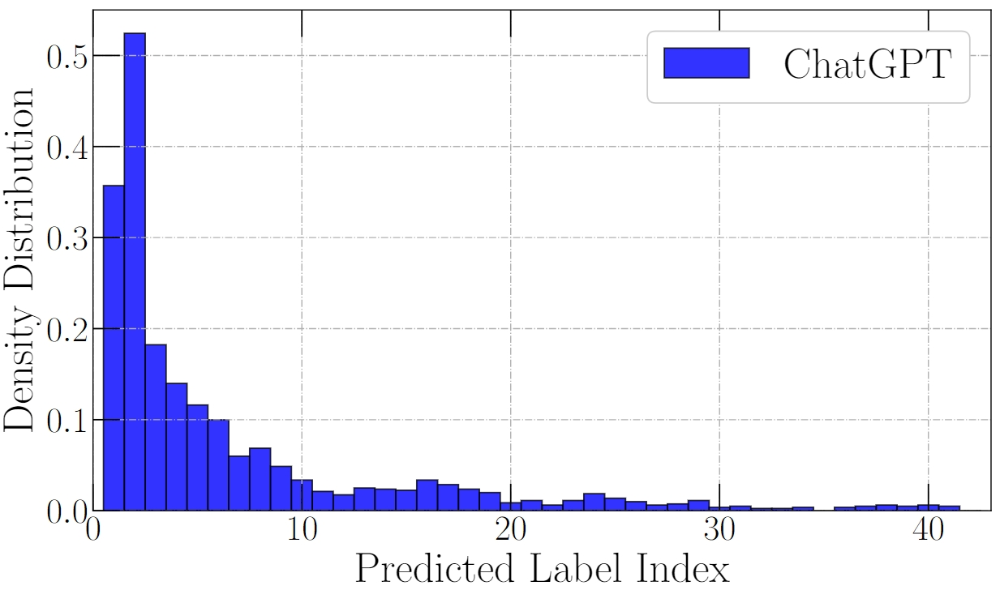
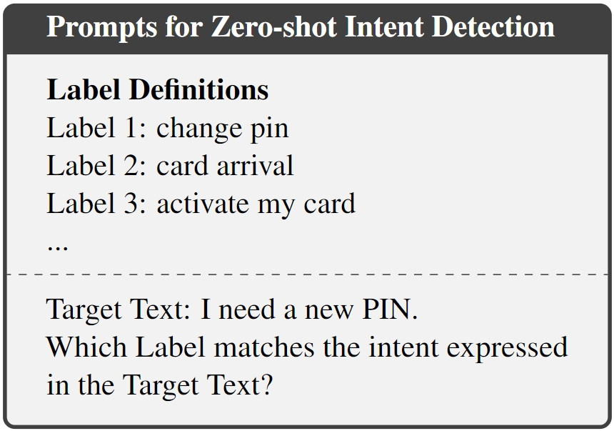
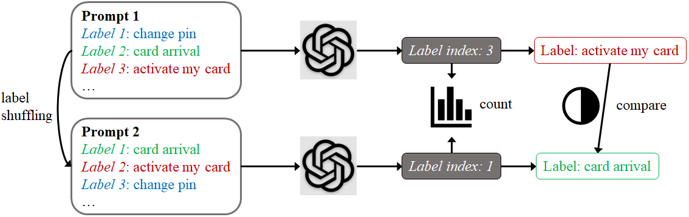

# MQuAKE

This is the repository for our paper [Primacy Effect of ChatGPT](https://openreview.net/).

In this paper, we study the \textit{primacy effect} of ChatGPT: the tendency of selecting the labels at earlier positions as the answer.
We have two main findings: i) ChatGPT's decision is sensitive to the order of labels in the prompt; ii) ChatGPT has a clearly higher chance to select the labels at earlier positions as the answer. We hope that our experiments and analyses provide additional insights into building more reliable ChatGPT-based solutions.

Please see [our paper](https://openreview.net/) for more details.



## Overview

Humans tend to recall information presented at the start of a list better than information at the middle or end. This phenomenon is known as the, which is a cognitive bias that relates to humans' attention spans, rehearsal, and memory systems. Similarly, in advertisement systems and search engines, humans tend to interact with items in higher positions regardless of the items' actual relevance. Primacy effect influences humans' behaviors to make unfair decisions. Similarly, if it exists in machine learning models, it may lead to worse performance.

The underlying behavioral similarity between ChatGPT and humans naturally leads to an intriguing question: Is ChatGPT also affected by the primacy effect?

ChatGPT provides a convenient way to achieve the discriminative natural language understanding (NLU). People only need to list the labels in the prompt and asking ChatGPT to select the label(s) that match the input text. 



In this work, to analyze the primacy effect of ChatGPT, we start by testing with random label shuffling, i.e., shuffling labels listed in the prompt before every prediction. We compare the predictions on the same instance with two different label orders. Then, we count the predicted label indices on many instances with label shuffling. The motivation is that: a fair NLU model should give the same prediction on an input instance regardless of how the labels are ordered; consequently, it should produce uniformly distributed label indices under label shuffling for any instance.



We discover the primacy effects of ChatGPT and finds that it highly influence the fairness of ChatGPT in NLU.
Our work contributes to better understanding the behaviors of ChatGPT and building more faithful solutions with ChatGPT in NLU applications.

## Bugs or Questions?
If you have any questions related to the repo or the paper, or you encounter any problems when using the datasets/code, feel free to email Yiwei Wang `(wangyw.evan@gmail.com)` or open an issue!

## Citation
If you use our code in your research, please cite our work:
```bibtex
@article{wang2023primacy,
  title={Primacy Effect of ChatGPT},
  author={Wang, Yiwei and etc.},
  journal={arXiv preprint arXiv:0000.00000},
  year={2023}
}
```